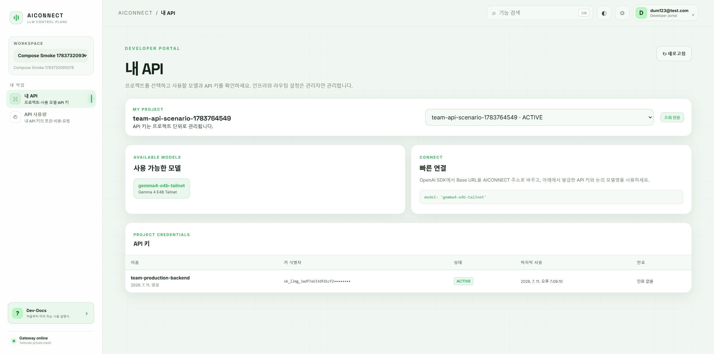
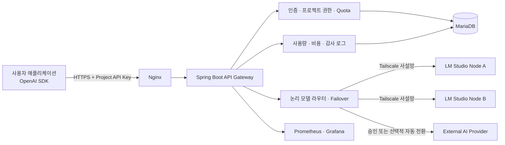
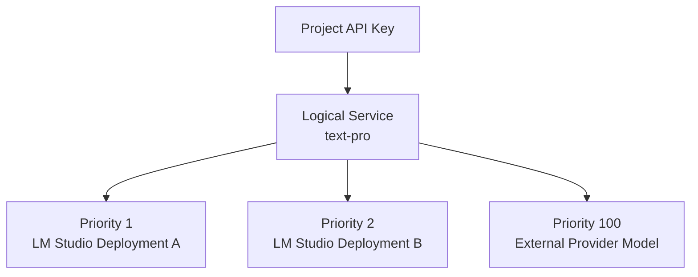
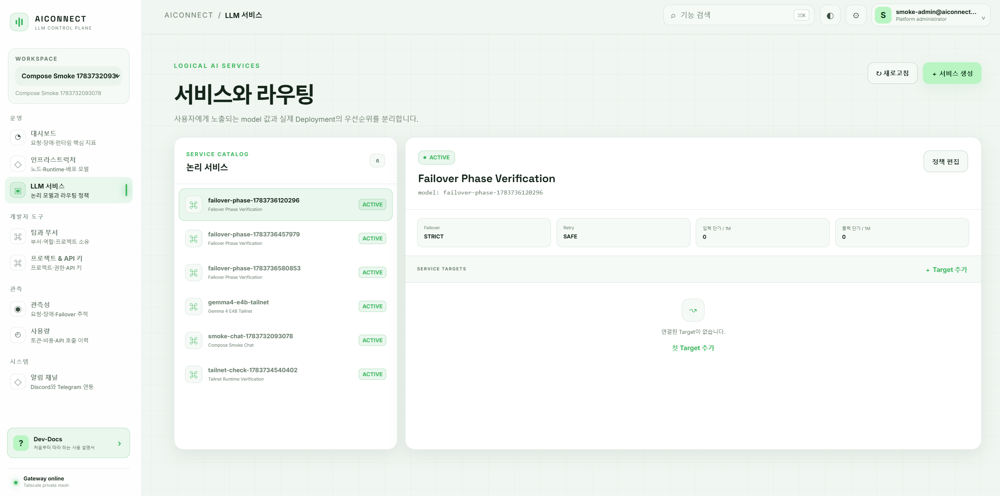
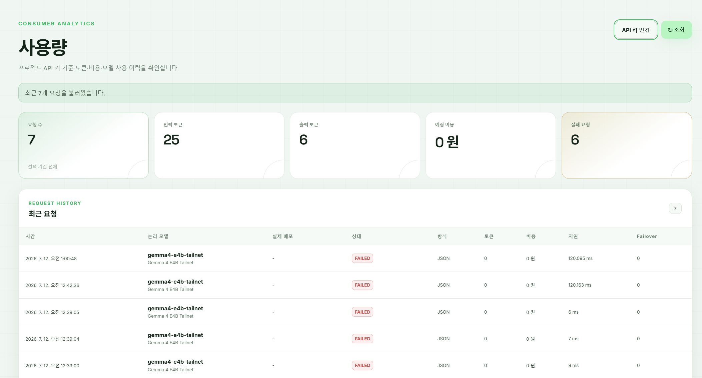
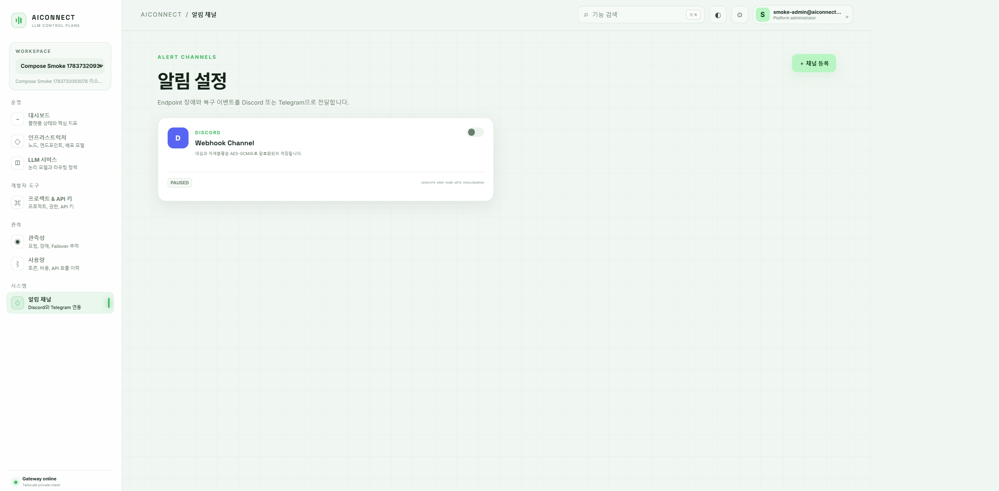
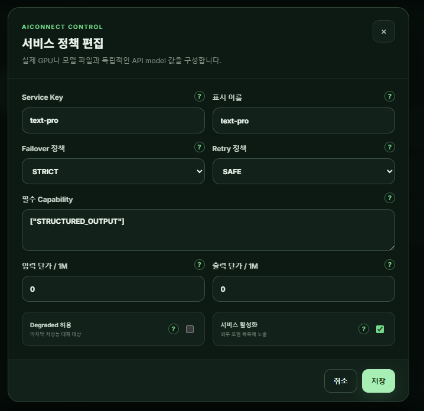
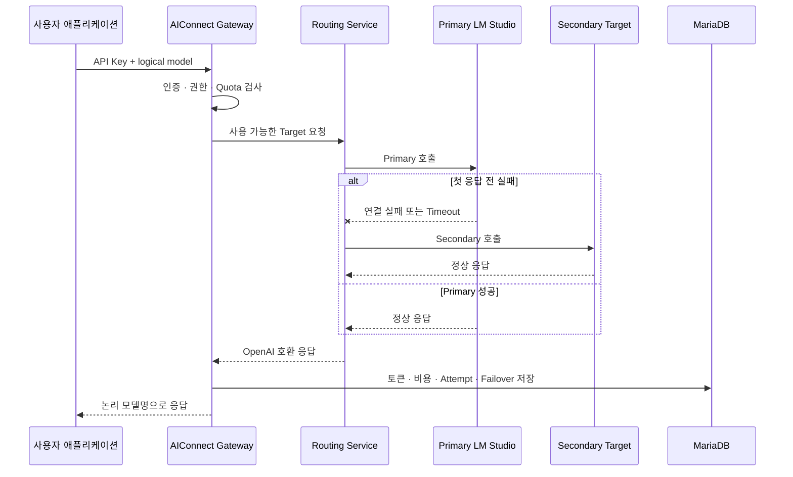

# AIConnect

<div align="center">

### 여러 GPU와 외부 AI를 하나의 API로 운영하는 LLM Control Plane

**OpenAI 호환 API Gateway · 논리 모델 라우팅 · 장애 전환 · 사용량 관측 · 멀티테넌시**

[](https://openjdk.org/)
[](https://spring.io/projects/spring-boot)
[](https://vuejs.org/)
[](https://mariadb.org/)
[](https://www.docker.com/)
[](#openai-호환-api)

</div>



## 프로젝트 소개

AIConnect는 여러 서버에서 실행되는 **LM Studio 기반 로컬 LLM**과 선택적으로 사용하는 **외부 AI Provider**를 하나의 OpenAI 호환 API로 제공하는 관리 플랫폼입니다.

사용자는 GPU 서버 주소나 실제 모델 파일을 알 필요 없이 `text-pro`와 같은 논리 모델명과 프로젝트 API 키만 사용합니다. 관리자는 실제 모델 배포, 우선순위, 장애 전환, 요청량, 토큰, 비용과 장애 이력을 중앙에서 관리합니다.

```text
사용자 애플리케이션
    ↓ OpenAI 호환 API
AIConnect Gateway
    ↓ 논리 모델 해석 · 권한 · Quota · 라우팅
LM Studio GPU 서버 또는 승인된 외부 AI Provider
```

### 해결하려는 문제

| 기존 운영의 문제 | AIConnect의 해결 방식 |
|---|---|
| GPU 서버 주소와 모델명이 애플리케이션에 직접 노출됨 | 사용자에게 논리 모델과 단일 Base URL만 제공 |
| 서버 장애 시 클라이언트 설정을 직접 변경해야 함 | 우선순위와 상태를 기준으로 다음 배포로 자동 전환 |
| 사용자·팀별 사용량을 알기 어려움 | 프로젝트, API 키, 서비스, 배포 단위로 사용량 집계 |
| 각 서버의 모델을 개별적으로 관리해야 함 | LM Studio Endpoint와 모델을 중앙에서 발견·동기화 |
| 로컬 GPU가 모두 중단되면 서비스가 멈춤 | 관리자 승인 기반 외부 AI 사용과 선택적 자동 전환 |
| 특정 GPU 종류에 종속된 관리 로직 | GPU가 아닌 Endpoint와 Deployment 상태로 라우팅 |

## 핵심 설계



### 물리 인프라와 API 계약의 분리



API 키는 특정 GPU나 서버가 아니라 프로젝트에 귀속됩니다. 관리자가 Target을 교체해도 사용자의 Base URL, API 키와 `model` 값은 바뀌지 않습니다.

## 주요 화면

### 개발자 포털

개발자는 자신이 참여한 프로젝트, 사용 가능한 논리 모델과 API 키를 한 화면에서 확인합니다. API 키는 마스킹해 표시하며 인프라와 라우팅 설정은 관리자 화면으로 분리합니다.

### 논리 서비스와 라우팅

사용자에게 공개할 논리 모델과 실제 Deployment의 우선순위를 분리합니다. Target별 우선순위, 가중치, 활성 상태와 동시성 제한을 설정할 수 있습니다.



### 사용량과 관측성

관리자는 조직 전체를, 프로젝트 소유자는 프로젝트 전체를, 개발자는 자신이 발급한 API 키 범위를 조회합니다. 요청, 토큰, 비용, 처리 배포와 Failover를 API 키 입력 없이 확인할 수 있습니다.



### 장애 알림

Endpoint 장애와 복구 이벤트를 Discord 또는 Telegram으로 전달하고 채널 상태와 전송 결과를 관리합니다.



### 서비스 정책

서비스 키, Failover·Retry 정책, 필수 Capability, 토큰 단가와 Degraded Target 허용 여부를 관리합니다.

<p align="center">
  
</p>

## 핵심 기능

### OpenAI 호환 API

- `GET /v1/models`
- `POST /v1/chat/completions`
- 일반 JSON 응답과 SSE 스트리밍
- 논리 모델명을 실제 Provider 모델 ID로 변환
- 입력·출력·Reasoning 토큰, 지연시간, 첫 토큰 시간과 처리 배포 기록

### Control Plane

- 조직, 팀·부서, 사용자와 역할 관리
- 프로젝트 생성·수정·중지·재개·삭제
- API 키 발급·폐기·폐기 기록 삭제
- 프로젝트별 논리 서비스 권한
- 관리자, 프로젝트 소유자, 개발자 권한 분리
- 관리자 작업 Audit Log

### LM Studio 운영

- Endpoint 연결 검사와 모델 자동 발견
- 모델 로드·언로드·다운로드 요청
- 컨텍스트 길이, GPU Offload, CPU Thread Pool, Flash Attention, KV Cache 설정
- 장치 정보가 없어도 Endpoint와 모델 운영 가능
- 특정 GPU 이름을 라우팅 조건으로 사용하지 않는 하드웨어 독립 구조

### 라우팅과 장애 전환

- 우선순위와 가중치 기반 Deployment 선택
- 최대 동시 요청과 활성 요청을 고려한 라우팅
- `STRICT`, `COMPATIBLE`, `DEGRADED` Failover 정책
- `SAFE`, `AGGRESSIVE` Retry 정책
- Endpoint Health Check, Circuit 상태, DRAINING과 복구 재투입
- 스트리밍 첫 데이터 전 실패만 안전하게 재시도

### 외부 AI Provider

- 조직별 Provider API 키 암호화 저장
- 사용자 사용 요청과 관리자 승인 흐름
- 관리자가 필요할 때 선택하는 수동 외부 모델
- 프로젝트별 `autoFailoverEnabled`가 켜진 경우에만 자동 전환
- 프로젝트별 월 비용 한도와 만료일
- Provider 종류와 `MANUAL_EXTERNAL`, `AUTO_FAILOVER` 라우팅 사유 기록

### 사용량과 운영 관측

- 프로젝트, API 키, 논리 서비스, 실제 배포, Provider별 집계
- 성공률, 입력·출력 토큰, 예상 비용, Failover 횟수
- 요청 Attempt와 오류 코드 추적
- Discord Webhook·Telegram 장애 및 복구 알림
- Prometheus 메트릭과 Grafana 대시보드
- 기본 `METADATA_ONLY`, 선택적 `FULL_ENCRYPTED` 요청 보관 정책

## 요청 처리 흐름



## OpenAI 호환 API

기존 OpenAI SDK에서 `base_url`, `api_key`, `model`만 AIConnect 값으로 변경합니다.

```python
from openai import OpenAI

client = OpenAI(
    base_url="https://gateway.example.com/v1",
    api_key="sk_llmg_...",
)

response = client.chat.completions.create(
    model="text-pro",
    messages=[
        {"role": "user", "content": "이 문서를 세 문장으로 요약해줘."}
    ],
)

print(response.choices[0].message.content)
```

스트리밍도 같은 Endpoint를 사용합니다.

```python
stream = client.chat.completions.create(
    model="text-pro",
    messages=[{"role": "user", "content": "점진적으로 답변해줘."}],
    stream=True,
)

for chunk in stream:
    print(chunk.choices[0].delta.content or "", end="")
```

## 배포 프로필

하나의 코드베이스를 조직 규모에 맞게 세 가지 방식으로 배포할 수 있습니다.

| 프로필 | 대상 | 구성 |
|---|---|---|
| Standalone | 개인, 소규모 팀, PoC | Gateway 1대, MariaDB, Nginx, 모니터링 |
| HA Compose | Kubernetes 없이 이중화가 필요한 조직 | Load Balancer, Gateway 2대, Redis 공유 상태 |
| Kubernetes | 자동 확장과 운영 표준화가 필요한 조직 | Deployment, HPA, PDB, Gateway API, 외부 DB·Redis |

### Ubuntu Standalone 빠른 설치

아무것도 설치되지 않은 Ubuntu VM에서 Docker, Tailscale Client와 AIConnect를 준비합니다.

```bash
git clone https://github.com/chefbeom/model-gateway-platform.git
cd model-gateway-platform

chmod +x deploy/fullsetting_quickstart_standingalone.sh
./deploy/fullsetting_quickstart_standingalone.sh
```

Tailscale 인증 후 배포를 완료합니다.

```bash
sudo tailscale up
./quickstart_standalone.sh
```

기존 Docker 환경에서는 `.env`를 준비한 뒤 실행할 수 있습니다.

```bash
cp .env.example .env
# placeholder를 서로 다른 충분히 긴 비밀값으로 변경
docker compose --env-file .env up -d --build --wait
```

> `.env`, 실제 API 키, LM Studio Token과 Tailscale Auth Key는 Git에 커밋하지 않습니다.

## 기술 스택

| 영역 | 기술 |
|---|---|
| Backend | Java 17, Spring Boot 3.5, Spring MVC, WebClient |
| Security | Spring Security, HMAC API Key, HttpOnly Refresh Cookie |
| Database | MariaDB 11.4, JPA, Flyway |
| Shared State | Local Store 또는 Redis |
| Frontend | Vue 3.5, TypeScript 5.7, Vite 6 |
| LLM Runtime | LM Studio OpenAI-compatible API |
| Private Network | Tailscale |
| Proxy | Nginx |
| Observability | Actuator, Micrometer, Prometheus, Grafana |
| Deployment | Docker Compose, HA Compose, Helm/Kubernetes |

## 보안 원칙

- 사용자 API 키와 내부 LM Studio Token을 분리합니다.
- API 키 원문은 발급 직후 한 번만 표시하고 HMAC 해시만 저장합니다.
- Provider 및 Runtime Token은 암호화해 저장합니다.
- GPU 서버의 LM Studio 포트를 공개 인터넷에 노출하지 않습니다.
- Gateway에서 GPU Runtime 포트로 향하는 최소 권한만 허용합니다.
- 프롬프트와 응답 원문은 기본적으로 저장하지 않습니다.
- Prometheus Label에 API 키, 요청 ID와 사용자 입력을 넣지 않습니다.

## 검증

- API 키 인증과 역할별 데이터 범위
- LM Studio 모델 발견과 동기화
- 일반 응답과 SSE 스트리밍
- Primary 실패와 안전한 Failover
- 동시 요청·RPM·월 토큰 Quota
- 외부 Provider 승인 전 차단과 승인 후 성공
- 외부 Provider 자동 전환 OFF/ON
- 사용량, 비용, Attempt와 감사 로그 저장
- Redis 공유 상태와 배포 프로필 검증
- Docker Compose 및 VM 종단간 시나리오

```bash
# Backend
gradle clean test bootJar --no-daemon

# Frontend
npm --prefix frontend run build

# Compose 계약
docker compose --env-file .env config -q
```

## 프로젝트 구조

```text
.
├─ src/                         Spring Boot Gateway와 Control Plane
│  ├─ main/java/                인증, 라우팅, Runtime, 사용량, 알림
│  ├─ main/resources/           설정과 Flyway Migration
│  └─ test/                     단위·통합 테스트
├─ frontend/                    Vue 3 관리·개발자 콘솔
├─ infra/                       Nginx, Prometheus, Grafana
├─ deploy/
│  ├─ standalone/               단일 Gateway 배포
│  ├─ ha/                       Load Balancer + 이중 Gateway + Redis
│  └─ kubernetes/               Helm Chart
├─ scripts/                     Smoke, Failover, 백업·복구 검증
├─ docs/                        사용자·관리자·운영 문서
└─ docker-compose.yml           기본 Standalone 스택
```

## 문서

- [Dev-Docs 목차](./docs/DEV_DOCS_INDEX_KO.md)
- [사용자 가이드](./docs/USER_GUIDE_KO.md)
- [관리자 가이드](./docs/ADMIN_GUIDE_KO.md)
- [외부 AI Provider 운영](./docs/EXTERNAL_PROVIDER_GUIDE_KO.md)
- [배포 프로필 전환](./docs/deployment-profile-migration.md)
- [운영 준비도](./docs/production-readiness.md)
- [전체 구현 감사](./docs/completion-audit.md)
- [OpenAPI 명세](./docs/openapi.yaml)

## 포트폴리오 핵심 경험

- 물리 GPU와 API 계약을 분리한 **Logical Service 추상화**
- 스트리밍 특성을 고려한 **안전한 Failover 경계 설계**
- API Key → Project → Team → Organization으로 이어지는 **멀티테넌트 권한 모델**
- 정확한 사용량 원본과 시스템 메트릭을 분리한 **관측성 설계**
- 로컬 GPU와 외부 Provider를 함께 다루는 **정책 기반 하이브리드 라우팅**
- 단일 서버에서 HA·Kubernetes까지 확장 가능한 **배포 프로필 설계**
- 실제 VM, Tailscale, LM Studio를 연결한 **종단간 배포 및 장애 진단 경험**

## 향후 계획

- `/v1/responses`, Embeddings 등 OpenAI 호환 Endpoint 확장
- 외부 Provider별 비용 정산과 예산 알림 고도화
- 다중 Relay·사설 네트워크를 위한 `ai-mesh-net` 연구
- 운영 대시보드 추세 차트와 SLO 리포트
- Agent 기반 선택적 GPU Telemetry

---

<div align="center">

**AIConnect는 GPU 종류가 아니라 서비스 계약, 상태, 용량과 정책을 기준으로 LLM을 운영합니다.**

</div>
